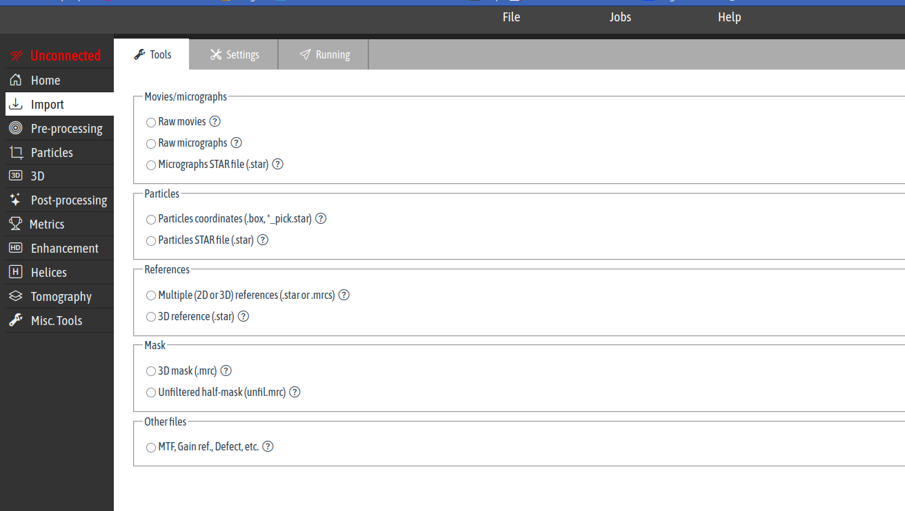
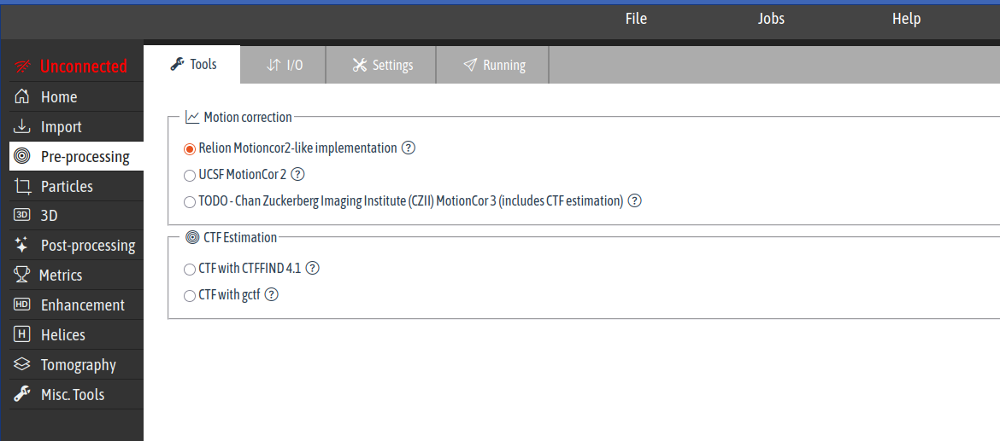
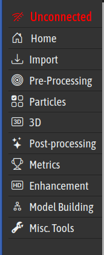
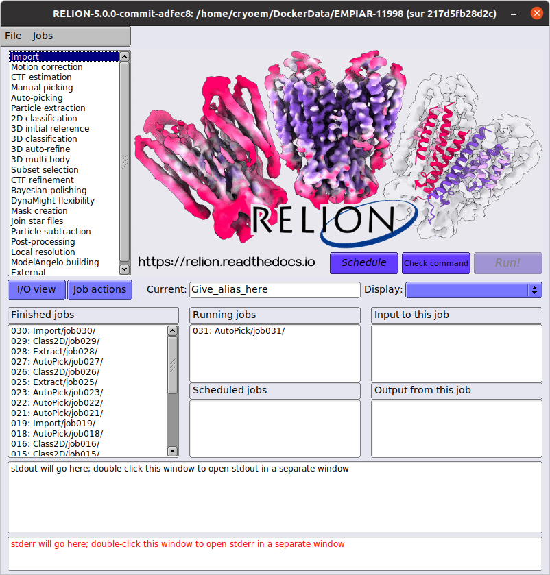
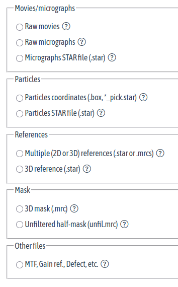
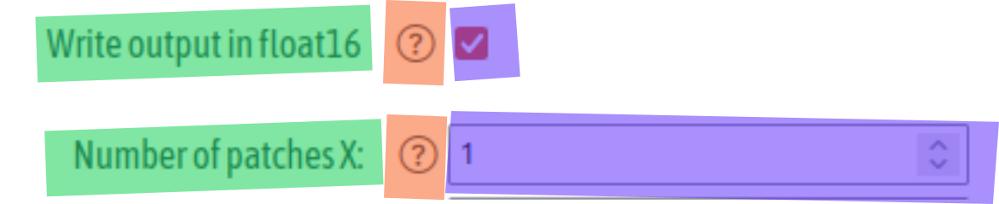

---

# GRINDER

####  GRINDER &mdash; [GR]aphics c[R]yoEM [I]nterface and [D]ata [E]xplore[R] for (cryo-EM [R]econstruction | [R]elion)

> GRINDER - [G]UI for [R]el[I]o[N] and a [D]atamin[ER]
> GRINDER &mdash; [G]raphics c[R]yoEM [IN]terface and [D]ata [E]xplore[R]
> Graphics Renderer for Interoperable Nano-scale Diagnostics and Execution Recipes.
> Graphical Renderer for Interoperable Node-based Data ExploreR

---
Great choice! That acronym feels like it belongs in a high-impact paper. Here is a polished **README** introduction you can use for your project page (GitHub, GitLab, etc.) that highlights the transition from complex tool-chains to your streamlined interface.

---
# GRINDER

**G**raphical **R**enderer for **I**nteroperable **N**ode-based **D**ata **E**xplore**R**

## Overview

**GRINDER** is a comprehensive orchestration layer for Single Particle Analysis (SPA) in cryo-electron microscopy. By bridging the gap between fragmented command-line utilities and high-level data analysis, GRINDER provides a unified environment to design, execute, and evaluate complex imaging pipelines.

In a field where data is massive and tool-interoperability is often a hurdle, GRINDER acts as the central hub—allowing researchers to focus on the science rather than the syntax.

## Key Features

* **Interoperable Pipeline Engine:** Seamlessly integrate various cryoEM toolsets into a single, cohesive workflow.
* **Node-Based Architecture:** Design your processing stream visually. Connect tools as nodes to manage dependencies and data flow intuitively.
* **Graphical Parameter Management:** Replace manual configuration files with a sleek interface for fine-tuning tool parameters.
* **Integrated Data Explorer:** Interactive dashboards provide real-time analysis, helping you monitor resolution, orientation distribution, and particle quality at a glance.

---
### Quick Start

> [!TIP]
> Use the **Graphical Renderer** to visualize your protein density maps immediately after the refinement nodes complete their run.

```bash
# Example: Launching the GRINDER interface
python3 -m grinder --ui

```

---

## Why GRINDER?

Single particle analysis is a "grind"—it requires iterative refinement and constant monitoring. **GRINDER** simplifies this by providing a robust **Data Explorer** that lets you dig into your results without leaving the pipeline environment.

---

To make the "How it works" section clear for users (who are likely cryoEM experts but want to save time), it’s best to explain the logic of moving from a **Node** (the tool) to the **Data Explorer** (the insight).

Here is a draft for that section:

---

## How it Works: The Node-to-Insight Workflow

**GRINDER** operates on a modular "Node-based" logic. Instead of managing disparate scripts, you interact with a visual graph where each node represents a specific cryoEM task.

### 1. The Graphical Setup (The "G" & "R")

Every tool in your pipeline (e.g., Motion Correction, CTF Estimation, 2D Classification) is represented as a **Node**.

* **Dynamic Parameters:** Clicking a node opens a graphical panel to adjust parameters (e.g., pixel size, dose, or symmetry).
* **Visual Rendering:** The **Renderer** provides immediate visual feedback on node status and preliminary outputs.

### 2. Interoperable Execution (The "I" & "N")

GRINDER handles the "handshake" between different software packages.

* **Cross-Talk:** It automatically formats the output of one tool (like a `.star` file from Relion) to be readable by the next tool in the sequence (like a `.cs` file for CryoSPARC).
* **Parallel Streams:** You can branch your pipeline to test different parameters simultaneously, with GRINDER managing the directory structures and environment variables in the background.

### 3. The Data Explorer (The "D-E-R")

This is where the "grind" pays off. The **Data Explorer** is an integrated dashboard that tracks your progress:

* **Real-time Metrics:** Monitor FSC curves, Euler angle distributions, and defocus values as they are generated.
* **Comparative Analysis:** Compare 3D volumes from different branches of your pipeline side-by-side to determine which parameters yielded the highest resolution.


---
### Overview

.w80[

]

---
### Overview

.w80[

]

---
### Left Panel

.grid_col2[
.column[
.w40[

]

]
.column[

]
]
---
### Left Panel

.grid_col2[
.column[
.w40[

]

]
.column[


| ID    |Title | Icon Name | Icon  |
|-------|------|------|-------|
| home       | 'Home      | bi-house-door | <i class="bi bi-house-door"></i>| 
| import | 'Import' |  bi-download| <i class="bi bi-download"></i>| 
| prep  | 'Pre-processing'  | bi-bullseye| <i class="bi bi-bullseye"></i>| 
| ptcls  | 'Particles'  | bi-ui-checks-grid| <i class="bi bi-ui-checks-grid"></i> or <i class="bi bi-crop"></i>| 
| rec3d  | '3D'  | bi-badge-3d| <i class="bi bi-badge-3d"></i>| 
| postp   | 'Post-processing'  | bi-stars| <i class="bi bi-stars"></i>| 
| metrics  | Metrics           | bi-trophy          | <i class="bi bi-trophy"></i>| 
| enhance  | Enhancement      | bi-badge-hd         | <i class="bi bi-badge-hd"></i>| 
| model    | 'Model Building' | bi-diagram-2         | <i class="bi bi-diagram-2"></i>| 
| tools    | "Misc. Tools"    | bi-wrench-adjustable | <i class="bi bi-wrench-adjustable"></i>| 

]
]
---
### Tabs


| ID    |Title | Icon Name | Icon  |
|-------|------|------|-------|
| io       | 'I/O'      | bi-arrow-down-up | <i class="bi bi-arrow-down-up"></i>| 
| settings | 'Settings' |  bi-tools| <i class="bi bi-tools"></i>| 
| display  | 'Display'  | bi-palette| <i class="bi bi-palette"></i>| 
| compute  | 'Compute'  | bi-cpu| <i class="bi bi-cpu"></i>| 
| running  | 'Running'  | bi-send| <i class="bi bi-send"></i>| 
| result   | 'Results'  | bi-eye| <i class="bi bi-eye"></i>| 

---
### Tab `Tools` of `Import`

#### Unfolding RELION `Import` tool

.grid_col2[
.column[
.w80[

]
]
.column[

| ID           |Title | Icon Name | Icon  |
|--------------|------|------|-------|
| movies       | 'Import Movies'      | bi-film | <i class="bi bi-film"></i>| 
| particles | 'Import Particles' |  bi-bounding-box ou bi-crop| <i class="bi bi-bounding-box"></i> ou <i class="bi bi-crop"></i>| 
| refs  | 'Import References'  | bi-r-circle| <i class="bi bi-r-circle"></i>| 
| masks  | 'Import Masks'  | bi-mask| <i class="bi bi-mask"></i>| 
| other  | 'Import Other files'  | bi-send| <i class="bi bi-file-binary"></i>| 

]
]

---
### Tab `Tools` of `Pre-processing` 

#### Grouping RELION `Motion Correction` and `CTF` tools

.grid_col2[
.column[

]
.column[


| ID           |Title | Icon Name | Icon  |
|--------------|------|------|-------|
| motion       | 'Motion Correction'      | bi-graph-up | <i class="bi bi-graph-up"></i>| 
| ctf       | 'CTF Estimation'      | bi-bullseye | <i class="bi bi-bullseye"></i>| 

]
]

---
### Tab `Tools` of others 

| ID           |Title | Icon Name | Icon  |
|--------------|------|------|-------|
| class2d       | '2D Classification'      | bi-sort-numeric-down | <i class="bi bi-sort-numeric-down"></i>| 
| class3d       | '3D Classification'      | bi-boxes | <i class="bi bi-boxes"></i>| 
| abinitio       | 'Ab Initio'      | bi-box | <i class="bi bi-box"></i>| 
---

# Widgets


---

### Widget Creation

A widget in RELION GUI is composed of three parts:

- A label
- A help
- A widget to set the parameter



---

### Widget Creation

| Parameters | Description | Value |
|------------|------------|------------|
| id         | Identifier | id defined by RELION in `joboptions[id]`|
| label      | Label       | defined by RELION |
| widget     | widget type specific to GRINDER | bool, int, string, range, file, select, tab, fieldset, switch |
| default    | Default value | Could be a number, boolean, string, etc |
| arg0        |  Extra arg  | defined by RELION  |
| arg1       | Extra arg  | defined by RELION  |
| arg2       | Extra arg  | defined by RELION  |
| help       | Help  | single or multi-line explanation text  |

---

### Widget &mdash; `bool`

.w60[

]

| id | label | widget | default | arg0 | arg1 | arg2 | help |
|------|------|------|------|------|------|------|------|
| do_float16 | 'Write output in float16' | bool | true | ? |? |? | If set to Yes, RelionCor2 will write output images in float16 MRC format. This will save a factor of two in disk space compared to the default of writing in float32. Note that RELION and CCPEM will read float16 images, but other programs may not (yet) do so. For example, Gctf will not work with float16 images. Also note that this option does not work with UCSF MotionCor2. For CTF estimation, use CTFFIND-4.1 with pre-calculated power spectra (activate the 'Save sum of power spectra' option). |

---

### Widget &mdash; `bool`

```STAR
loop_
_fieldset.id
_fieldset.label
_fieldset.widget
_fieldset.default  # Default value
_fieldset.arg0     # None
_fieldset.arg1     # None
_fieldset.arg2     # None
_fieldset.help
do_float16 'Write output in float16' bool true ? ? ?
;If set to Yes, RelionCor2 will write output images in float16 MRC format. 
This will save a factor of two in disk space compared to the default of writing in float32. 
Note that RELION and CCPEM will read float16 images, but other programs may not (yet) do so. 
For example, Gctf will not work with float16 images. 
Also note that this option does not work with UCSF MotionCor2. 
For CTF estimation, use CTFFIND-4.1 with pre-calculated power spectra 
(activate the 'Save sum of power spectra' option).
;
```
---

### Widget &mdash; `int`


```STAR
loop_
_fieldset.id
_fieldset.label
_fieldset.widget
_fieldset.default  # Default value
_fieldset.arg0     # None
_fieldset.arg1     # None
_fieldset.arg2     # None
_fieldset.help
patch_x 'Number of patches X:' int 1 ? ? ? 'Number of patches (in X and Y direction) to apply motioncor2.'
```
---

### Widget &mdash; `string`


```STAR
loop_
_fieldset.id
_fieldset.label
_fieldset.widget
_fieldset.default  # Default value
_fieldset.arg0     # None
_fieldset.arg1     # None
_fieldset.arg2     # None
_fieldset.help
other_args 'Additional Parameters' string '' ? ? ? 'Additional arguments that need to be passed'
```
---

### Widget &mdash; `range`


```STAR
loop_
_fieldset.id
_fieldset.label
_fieldset.widget
_fieldset.default  # Default value
_fieldset.arg0     # Min value
_fieldset.arg1     # Max value
_fieldset.arg2     # Step
_fieldset.help
first_frame_sum 'First frame for corrected sum:' range 1 1 32 1 'First frame to use in corrected average (starts counting at 1).'
```
---

### Widget &mdash; `file`


```STAR
loop_
_input.id
_input.label
_input.widget
_input.default  # None
_input.arg0     # filetype
_input.arg1     # placeholder
_input.arg2     # Directory
_input.help
todo     'Input movies STAR file:'  file ? LABEL_PARTS_CPIPE 'STAR files (*.star). Image stacks (not recommended, read help!) (*.{spi,mrcs})' ? 'No help'
```

---

### Widget &mdash; select and option(s)

.w40[

]

```STAR
loop_
_fieldset.id
_fieldset.label
_fieldset.widget
_fieldset.default  # Default value
_fieldset.arg0     # <select> parent
_fieldset.arg1     # None
_fieldset.arg2     # None
_fieldset.help
gain_rot 'Gain rotation:' select 0 ? ? ? 'Rotate the gain reference by this number times 90 degrees' 
#
loop_
_gain_rot.id
_gain_rot.label
_gain_rot.widget
_gain_rot.default  # Default value
_gain_rot.arg0     # <select> parent
_gain_rot.arg1     # None
_gain_rot.arg2     # None
_gain_rot.help
no_rot   'No rotation'   option 0 gain_rot ? ? ?
rot_90   '90° rotation'  option 1 gain_rot ? ? ?
rot_180  '180° rotation' option 2 gain_rot ? ? ?
rot_270  '270° rotation' option 3 gain_rot ? ? ?
```

---
### Widgets Group &mdash;  `tab`


.w40[

]

```cif
loop_
_groups.id
_groups.label
_groups.icon
_groups.widget
_groups.default
_groups.parent_id
_groups.help
io       'I/O'                    bi-arrow-down-up       tab ? ? ?
settings 'Settings'               bi-tools               tab ? ? ?
```

---
### Widgets Group &mdash;  `fieldset`


.w40[

]

```STAR
loop_
_groups.id
_groups.label
_groups.icon
_groups.widget
_groups.default    # true/false for `switch` and ? | `hidden` for fieldset
_groups.parent_id
_groups.help
io       'I/O'                    bi-arrow-down-up       tab ? ? ?
settings 'Settings'               bi-tools               tab ? ? ?
general  'General'                bi-chat-right-text     fieldset ?      settings ?
```

---
### Widgets Group &mdash; `switch`


.w60[

]

```STAR
loop_
_groups.id
_groups.label
_groups.icon
_groups.widget
_groups.default
_groups.parent_id
_groups.help
do_queue 'Submit to queue?'       bi-box-arrow-in-right  switch   false  running
;If set to Yes, the job will be submitted to a queue, otherwise the job will be executed locally. 
Note that only MPI jobs may be sent to a queue. The default can be set through the environment 
variable RELION_QUEUE_USE.
;
```

---

### Fieldset Icons in `I/O`, Settings, Running, etc.

| ID           |Title | Icon Name | Icon  |
|--------------|------|------|-------|
| input        | 'Input'   |  bi-arrow-bar-down | <i class="bi bi-arrow-bar-down"></i> |
| general      | 'General'  | bi-chat-right-text| <i class="bi bi-chat-right-text"></i>| 
| optimize     | 'Optimization'  | bi-rocket-takeoff| <i class="bi bi-rocket-takeoff"></i>| 
| other        | 'Additional Parameters' | bi-chat-right-dots | <i class="bi bi-chat-right-dots"></i>| 
|disk          | 'Disk Access' | bi-hdd-rack-fill |<i class="bi bi-hdd-rack-fill"></i> or <i class="bi bi-database-add"></i>| 
| use_gpu      | 'Use GPU Acceleration?' |  bi-gpu-card | <i class="bi bi-gpu-card"></i>| 
| process      | 'Processes'             | bi-gear-fill | <i class="bi bi-gear-fill"></i>| 
| do_queue     | 'Submit to queue?'  |  bi-box-arrow-in-right | <i class="bi bi-box-arrow-in-right"></i>| 
---
### Fieldset (_Toolbox_) in `Tools`

.grid_col2[
.column[

]
.column[


]
]


