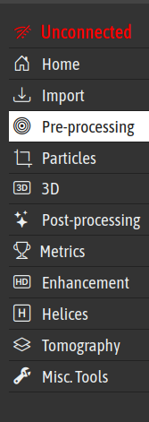
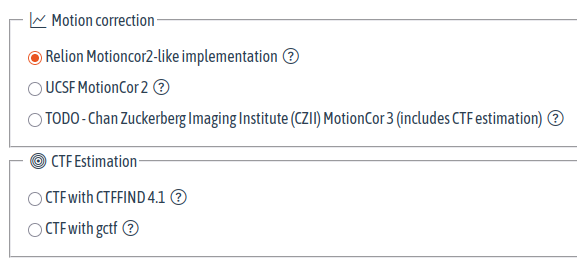
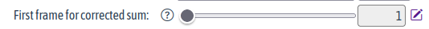
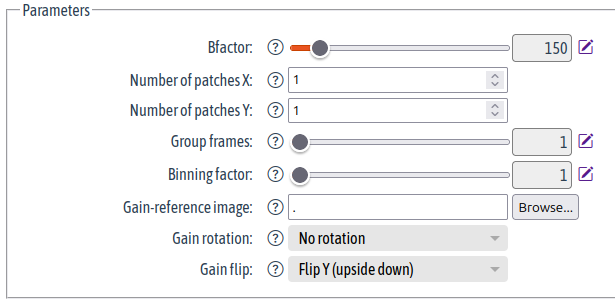
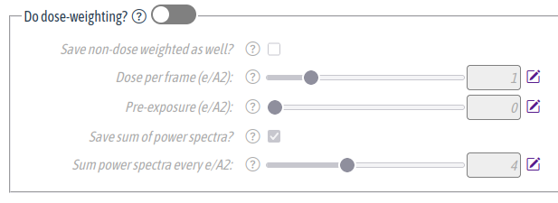

---

# GRINDER GUI

####  GRINDER &mdash; [GR]aphics [I]nterface and [D]ata [E]xplorer for (cryo-EM [R]econstruction | [R]elion)

> GRINDER - [G]UI for [R]el[I]o[N] and a [D]atamin[ER]


---
### Left Panel

.grid_col2[
.column[
.w40[

]

]
.column[


| ID    |Title | Icon Name | Icon  |
|-------|------|------|-------|
| home       | 'Home      | bi-house-door | <i class="bi bi-house-door"></i>| 
| import | 'Import' |  bi-download| <i class="bi bi-download"></i>| 
| prep  | 'Pre-processing'  | bi-bullseye| <i class="bi bi-bullseye"></i>| 
| ptcls  | 'Particles'  | bi-ui-checks-grid| <i class="bi bi-ui-checks-grid"></i> or <i class="bi bi-crop"></i>| 
| rec3d  | '3D'  | bi-badge-3d| <i class="bi bi-badge-3d"></i>| 
| postp   | 'Post-processing'  | bi-stars| <i class="bi bi-stars"></i>| 
| metrics  | Metrics           | bi-trophy          | <i class="bi bi-trophy"></i>| 
| enhance  | Enhancement      | bi-badge-hd         | <i class="bi bi-badge-hd"></i>| 
| model    | 'Model Building' | bi-diagram-2         | <i class="bi bi-diagram-2"></i>| 
| tools    | "Misc. Tools"    | bi-wrench-adjustable | <i class="bi bi-wrench-adjustable"></i>| 

]
]
---
### Tabs


| ID    |Title | Icon Name | Icon  |
|-------|------|------|-------|
| io       | 'I/O'      | bi-arrow-down-up | <i class="bi bi-arrow-down-up"></i>| 
| settings | 'Settings' |  bi-tools| <i class="bi bi-tools"></i>| 
| display  | 'Display'  | bi-palette| <i class="bi bi-palette"></i>| 
| compute  | 'Compute'  | bi-cpu| <i class="bi bi-cpu"></i>| 
| running  | 'Running'  | bi-send| <i class="bi bi-send"></i>| 
| result   | 'Results'  | bi-eye| <i class="bi bi-eye"></i>| 

---
### Import Fieldsets (_Tool categories_) in `Tools`

.grid_col2[
.column[

]
.column[

| ID           |Title | Icon Name | Icon  |
|--------------|------|------|-------|
| movies       | 'Import Movies'      | bi-film | <i class="bi bi-film"></i>| 
| particles | 'Import Particles' |  bi-bounding-box ou bi-crop| <i class="bi bi-bounding-box"></i> ou <i class="bi bi-crop"></i>| 
| refs  | 'Import References'  | bi-r-circle| <i class="bi bi-r-circle"></i>| 
| masks  | 'Import Masks'  | bi-mask| <i class="bi bi-mask"></i>| 
| other  | 'Import Other files'  | bi-send| <i class="bi bi-file-binary"></i>| 

]
]

---

# Widgets

---

### Widget &mdash; `bool`

.w60[

]


```STAR
loop_
_fieldset.id
_fieldset.label
_fieldset.widget
_fieldset.default  # Default value
_fieldset.arg0     # None
_fieldset.arg1     # None
_fieldset.arg2     # None
_fieldset.help
do_float16 'Write output in float16' bool true ? ? ?
;If set to Yes, RelionCor2 will write output images in float16 MRC format. 
This will save a factor of two in disk space compared to the default of writing in float32. 
Note that RELION and CCPEM will read float16 images, but other programs may not (yet) do so. 
For example, Gctf will not work with float16 images. 
Also note that this option does not work with UCSF MotionCor2. 
For CTF estimation, use CTFFIND-4.1 with pre-calculated power spectra 
(activate the 'Save sum of power spectra' option).
;
```
---

### Widget &mdash; `int`


```STAR
loop_
_fieldset.id
_fieldset.label
_fieldset.widget
_fieldset.default  # Default value
_fieldset.arg0     # None
_fieldset.arg1     # None
_fieldset.arg2     # None
_fieldset.help
patch_x 'Number of patches X:' int 1 ? ? ? 'Number of patches (in X and Y direction) to apply motioncor2.'
```
---

### Widget &mdash; `string`


```STAR
loop_
_fieldset.id
_fieldset.label
_fieldset.widget
_fieldset.default  # Default value
_fieldset.arg0     # None
_fieldset.arg1     # None
_fieldset.arg2     # None
_fieldset.help
other_args 'Additional Parameters' string '' ? ? ? 'Additional arguments that need to be passed'
```
---

### Widget &mdash; `range`



```STAR
loop_
_fieldset.id
_fieldset.label
_fieldset.widget
_fieldset.default  # Default value
_fieldset.arg0     # Min value
_fieldset.arg1     # Max value
_fieldset.arg2     # Step
_fieldset.help
first_frame_sum 'First frame for corrected sum:' range 1 1 32 1 'First frame to use in corrected average (starts counting at 1).'
```
---

### Widget &mdash; `file`


```STAR
loop_
_input.id
_input.label
_input.widget
_input.default  # None
_input.arg0     # filetype
_input.arg1     # placeholder
_input.arg2     # Directory
_input.help
todo     'Input movies STAR file:'  file ? LABEL_PARTS_CPIPE 'STAR files (*.star). Image stacks (not recommended, read help!) (*.{spi,mrcs})' ? 'No help'
```

---

### Widget &mdash; select and option(s)


```STAR
loop_
_fieldset.id
_fieldset.label
_fieldset.widget
_fieldset.default  # Default value
_fieldset.arg0     # <select> parent
_fieldset.arg1     # None
_fieldset.arg2     # None
_fieldset.help
gain_rot 'Gain rotation:' select 0 ? ? ? 
;Rotate the gain reference by this number times 90 degrees clockwise in relion_display. 
This is the same as -RotGain in MotionCor2. Note that MotionCor2 uses a different convention 
for rotation so it says 'counter-clockwise'. Valid values are 0, 1, 2 and 3.
;
no_rot   'No rotation'   option 0 gain_rot ? ? ?
rot_90   '90° rotation'  option 1 gain_rot ? ? ?
rot_180  '180° rotation' option 2 gain_rot ? ? ?
rot_270  '270° rotation' option 3 gain_rot ? ? ?
```

---
### Widgets Group &mdash;  `tab`


.w40[

]

```cif
loop_
_groups.id
_groups.label
_groups.icon
_groups.widget
_groups.default
_groups.parent_id
_groups.help
io       'I/O'                    bi-arrow-down-up       tab ? ? ?
settings 'Settings'               bi-tools               tab ? ? ?
```

---
### Widgets Group &mdash;  `fieldset`


.w40[

]

```STAR
loop_
_groups.id
_groups.label
_groups.icon
_groups.widget
_groups.default    # true/false for `switch` and ? | `hidden` for fieldset
_groups.parent_id
_groups.help
io       'I/O'                    bi-arrow-down-up       tab ? ? ?
settings 'Settings'               bi-tools               tab ? ? ?
general  'General'                bi-chat-right-text     fieldset ?      settings ?
```

---
### Widgets Group &mdash; `switch`


.w60[

]

```STAR
loop_
_groups.id
_groups.label
_groups.icon
_groups.widget
_groups.default
_groups.parent_id
_groups.help
do_queue 'Submit to queue?'       bi-box-arrow-in-right  switch   false  running
;If set to Yes, the job will be submitted to a queue, otherwise the job will be executed locally. 
Note that only MPI jobs may be sent to a queue. The default can be set through the environment 
variable RELION_QUEUE_USE.
;
```


---
### Fieldset (_Toolbox_) in `Tools`

.grid_col2[
.column[

]
.column[


| ID           |Title | Icon Name | Icon  |
|--------------|------|------|-------|
| motion       | 'Motion Correction'      | bi-graph-up | <i class="bi bi-graph-up"></i>| 
| ctf       | 'CTF Estimation'      | bi-bullseye | <i class="bi bi-bullseye"></i>| 


| ID           |Title | Icon Name | Icon  |
|--------------|------|------|-------|
| class2d       | '2D Classification'      | bi-sort-numeric-down | <i class="bi bi-sort-numeric-down"></i>| 
| class3d       | '3D Classification'      | bi-boxes | <i class="bi bi-boxes"></i>| 
| abinitio       | 'Ab Initio'      | bi-box | <i class="bi bi-box"></i>| 

]
]

---

### Fieldset in `I/O`, Settings, Running, etc.

| ID           |Title | Icon Name | Icon  |
|--------------|------|------|-------|
| input        | 'Input'   |  bi-arrow-bar-down | <i class="bi bi-arrow-bar-down"></i> |
| general      | 'General'  | bi-chat-right-text| <i class="bi bi-chat-right-text"></i>| 
| optimize     | 'Optimization'  | bi-rocket-takeoff| <i class="bi bi-rocket-takeoff"></i>| 
| other        | 'Additional Parameters' | bi-chat-right-dots | <i class="bi bi-chat-right-dots"></i>| 
|disk          | 'Disk Access' | bi-hdd-rack-fill |<i class="bi bi-hdd-rack-fill"></i> or <i class="bi bi-database-add"></i>| 
| use_gpu      | 'Use GPU Acceleration?' |  bi-gpu-card | <i class="bi bi-gpu-card"></i>| 
| process      | 'Processes'             | bi-gear-fill | <i class="bi bi-gear-fill"></i>| 
| do_queue     | 'Submit to queue?'  |  bi-box-arrow-in-right | <i class="bi bi-box-arrow-in-right"></i>| 
